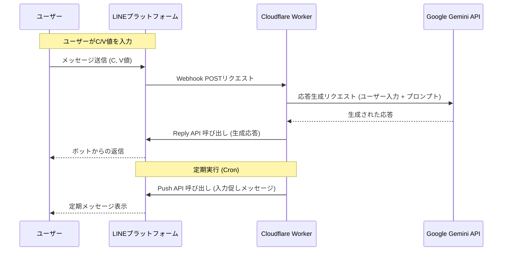

```mermaid
sequenceDiagram
    participant User as ユーザー
    participant LINE as LINEプラットフォーム
    participant Worker as Cloudflare Worker
    participant Gemini as Google Gemini API

    Note over User, LINE: ユーザーがC/V値を入力

    User->>LINE: メッセージ送信 (C, V値)
    LINE->>Worker: Webhook POSTリクエスト
    Worker->>Gemini: 応答生成リクエスト (ユーザー入力 + プロンプト)
    Gemini-->>Worker: 生成された応答
    Worker->>LINE: Reply API 呼び出し (生成応答)
    LINE-->>User: ボットからの返信

    Note over Worker, LINE: 定期実行 (Cron)

    Worker->>LINE: Push API 呼び出し (入力促しメッセージ)
    LINE-->>User: 定期メッセージ表示
``` 